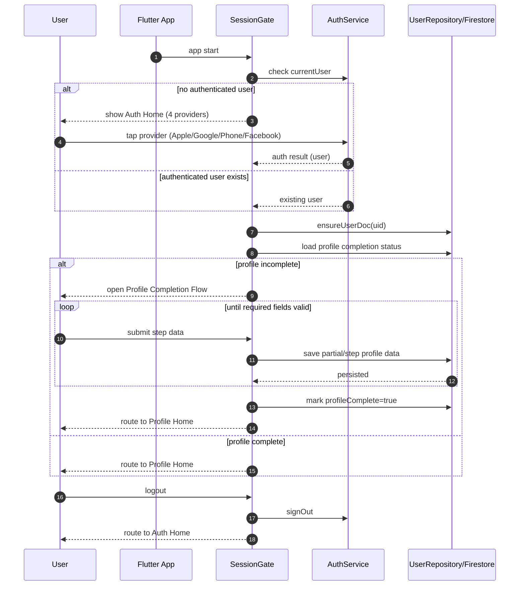

# Next Phase Plan: Unified Auth + Profile Completion + Persistent Session

## 1) Request Summary (What You Asked)

You want the next implementation to do all of the following:

1. Support 4 auth options on the home screen:
- Apple
- Google
- Phone
- Facebook

2. Remove separate "Sign in" vs "Create account" interaction complexity on the home screen.
- Keep one elegant "Continue" concept.
- User picks any provider and system handles sign-in/create automatically.

3. After first successful auth, user must complete an interactive dating profile flow.
- We should propose profile fields and review together.
- Data must be saved to database.

4. Returning user behavior:
- If profile is complete: go to Profile Home directly.
- If profile is incomplete: always land back on Profile Completion until done.
- Only explicit logout should return user to auth home screen.

5. Target page states:
- Login Home Screen (auth entry)
- Account/Profile Creation Flow
- Profile Home Page

---

## 2) Proposed App Architecture (Target)

```mermaid
flowchart TD
    A[App Launch] --> B[SessionGate / Bootstrap]

    B --> C{FirebaseAuth.currentUser exists?}
    C -- No --> H[Auth Home Screen\n4 providers + Continue copy]
    C -- Yes --> D[Ensure users/{uid} doc]

    D --> E[Read profile status\nprofileComplete + required fields]
    E --> F{Profile complete?}

    F -- No --> P[Profile Completion Flow\ninteractive steps]
    P --> S[Persist profile data]
    S --> T{Saved & valid?}
    T -- No --> P
    T -- Yes --> G[Profile Home]

    F -- Yes --> G[Profile Home]

    H --> I[Apple Auth]
    H --> J[Google Auth]
    H --> K[Phone Auth]
    H --> L[Facebook Auth]

    I --> M[Auth success]
    J --> M
    K --> M
    L --> M

    M --> D

    G --> Z[Logout action]
    Z --> H
```

### Core modules

- `SessionGate` (new): single decision point after app launch.
- `AuthHome` (existing Home UI, simplified intent): provider entry only.
- `AuthService`: provider-specific auth methods.
- `UserRepository`: user document lifecycle + profile persistence.
- `ProfileCompletionFlow` (multi-step): required onboarding fields.
- `ProfileHome`: post-onboarding landing screen.

### Why this architecture

- One canonical startup decision path.
- No duplicated auth/create logic in UI.
- Deterministic routing for first-time and returning users.
- Easy future additions (new providers, new required fields).

---

## 3) Detailed Runtime Flow



---

## 4) Proposed Firestore User Shape (Draft)

`users/{uid}`

- `uid: string`
- `authProviders: string[]` (e.g. `['google.com']`)
- `displayName: string?`
- `email: string?`
- `phoneNumber: string?`
- `photoUrl: string?`
- `createdAt: timestamp`
- `lastLoginAt: timestamp`
- `updatedAt: timestamp`
- `profileComplete: bool`
- `onboardingStep: string` (for resume safety)

Profile section (dating):
- `profile.firstName: string`
- `profile.birthDate: timestamp`
- `profile.gender: string`
- `profile.lookingFor: string[]`
- `profile.city: string`
- `profile.bio: string`
- `profile.photos: string[]`
- `profile.interests: string[]`
- `profile.languages: string[]`
- `profile.faithValues: string[]` (optional for your brand)

---

## 5) Interactive Profile Questions (Draft v1)

Recommended minimum required fields for first release:

1. First name
2. Date of birth (age gate)
3. Gender
4. Who are you interested in?
5. City / location
6. 2-3 photos minimum
7. Short bio (40-300 chars)

Nice-to-have next:

1. Height
2. Occupation / education
3. Languages
4. Interests (multi-select)
5. Lifestyle values (faith/family/goals)

---

## 6) UX Direction (Based on Your Decision)

Home screen:
- Keep elegant hero layout.
- One clear heading/copy (Continue).
- 4 large icon buttons (Apple, Google, Phone, Facebook).
- No explicit create-vs-sign-in mode switch.

Behavior:
- Provider tap always means "continue".
- Backend determines whether user is new or returning.

---

## 7) Implementation Order (Next Coding Phase)

1. Add Facebook auth in `AuthService` + platform configs.
2. Add `SessionGate` route as true app entry point.
3. Move launch routing logic out of home widget into `SessionGate`.
4. Create multi-step `ProfileCompletionFlow` with save/resume.
5. Add `ProfileHome` route and landing logic.
6. Enforce incomplete profile redirect at startup.
7. Keep logout as only path back to auth home.

---

## 8) Acceptance Criteria

- New user can auth with any provider and is routed to profile completion.
- Incomplete profile users always resume completion flow on launch.
- Completed users always land on profile home on launch.
- Logout always routes back to auth home.
- No duplicate sign-in/create-account UI path required.

---

## 9) Database Write Timing (Explicit Rule)

The app must write to Firestore immediately after successful authentication, even if the user has not completed profile onboarding.

Required behavior:

1. Auth success -> immediately `ensureUserDoc(uid)` and write login metadata (`lastLoginAt`, providers).
2. Set or keep `profileComplete = false` until onboarding is fully finished.
3. Persist onboarding answers incrementally per step/screen (resume-safe).
4. Only set `profileComplete = true` after all required profile fields are valid and saved.
